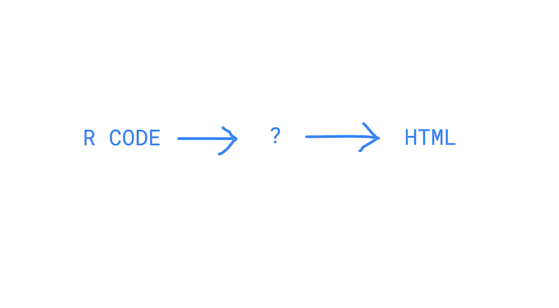

<!-- To do: simplify code to minimal examples/remove dependencies e.g. emojifont-->

## Goals

Present logic and tools for interactively plotting *static* data

In two weeks we'll discuss Shiny, where data can be *dynamic*

- When to use interactivity
- Work through examples with
    - Plotly  
    - Crosstalk  
- Other packages, RBokeh, Highcharter  
- What's going on on under the hood

<!--look more into leaflet-->
<!-- which ones have ability to write your own js to add to event handlers-->

## Why Interactive Plots?

> - ~~They look cool~~
> - Exploratory data analysis, your own or the user's
> - Browser-based, easy to share
> - Expose the data
> - Increase the amount of information you can share cleanly
> - ~~They reduce decision-making~~. Plots you publish should have an argument, focus reader attention
> - Brushing and linking help uncover relationships in the data
> - Can be used instead of shiny in some cases

<!-- Best practices for interactivity. One slide? Sprinkled throughout? -->

## Motivating example: Pizza to the Polls {.smaller}

**[Pizza to the polls](https://polls.pizza/)**    
Delivered over 10,000 pizzas to 41 states    
Data from 2018 midterm elections

The data is in the intro_to_interactive folder. Load it as below and view fields.

```{r setup, echo = F, cache = T, warning = F, messsage = F, results = "hide"}

# Packages to use code and txhousing examples
# data processing
library(dplyr)
library(forcats)
library(reshape2)
# plotting
library(ggplot2)
library(plotly)
library(crosstalk)
library(highcharter)
library(rbokeh)
library(DT)
library(listviewer)
library(widgetframe)
library(htmltools)

# Additional packages for pizza example
library(sf)
library(emojifont)
library(USAboundaries) #has state, county, congressional district and other shape files
library(USAboundariesData)

#devtools::install_github("dkahle/ggmap") #avolids bugs
#library(ggmap)
#library(ggrepel)
#library(stringr)
#library(grDevices)
#library(showtext)

```

<!-- I used google map API to get lat/long, standardized variable names.
From the original data shared with me I removed some unnecessary fields,
("X", "Other.Info", "Contact.Info", "Slack.Thread", "Pizza.phone.number", "Slack.ID", "Twitter.Thread", "Tweet.ID"),
removed 14 missing-address rows, reformatted dates and filtered down to just 2018 midterms -->

```{r load_pizza, cache = F}
setwd("~/Documents/DSI/intro_to_interactive") # UPDATE path to intro_to_interactive
pizza = read.csv("pizza_midterms.csv")
names(pizza) # We're interested in a subset of these fields
```

We introduce some concepts using the texas housing (`txhousing`) data that's packaged with `plotly`. This data set has information on median housing prices and other sales information (volume, listing, inventory) over time for cities in Texas. 

## Pizza data {.smaller}

```{r}
head(pizza, 3)
```

## Example - Static Plot

Here is a static plot built in ggplot. What is it lacking?

```{r data_pre_process, cache = T, echo = F, results = "hide"}

# Group by location
pizza.grouped = pizza %>% group_by(lat, lon, Status) %>% 
  summarize(Pizzas_delivered = sum(Number_of_pizzas, na.rm = TRUE),
            Polling_place = first(Polling_place_address),
            City = first(City), # note there are some errors in city and state
            State = first(State))

#remove USA from polling place address
pizza.grouped$Polling_place = gsub(", USA", "", pizza.grouped$Polling_place)
pizza.grouped$pizza = emoji(ifelse(pizza.grouped$Status == "Delivered", "pizza", "grey_question"))
```

```{r geographic_boundaries, cache = T, results = "hide", echo = F}

us.state = us_boundaries(type = "state")
us.congressional = us_boundaries(type = "congressional")
us.county = us_boundaries(type = "county")

```

```{r static_pizza_plots, cache = T, echo = F}

# No geographcy
plot1 = ggplot(pizza.grouped, aes(x = lon, y = lat, size = Pizzas_delivered)) + 
          geom_point(aes(color = Status), alpha = .5) +
          ggtitle("Pizza to the polls 2018 midterms: Locations of deliveries and reports")

# Geography
plot2 = ggplot() + 
          geom_sf(data = us.state, inherit.aes = FALSE) +
          geom_sf(data = us.congressional, lwd = .3, fill = NA) +
          ylim(24,75) + xlim(-175, -67) +
          geom_point(data = pizza.grouped, aes(x = lon, y = lat, size = Pizzas_delivered, color = Status), alpha = .5) + 
          ggtitle("Pizza to the polls 2018 midterms: Locations of deliveries and reports")

# Geography -  Pizza only

plot3 = ggplot() + 
          geom_sf(data = us.state, inherit.aes = FALSE) +
          geom_sf(data = us.congressional, lwd = .3, fill = NA) +
          ylim(24,75) + xlim(-175, -67) +
          geom_point(data = filter(pizza.grouped, Status == "Delivered"),
                     aes(x = lon, y = lat, size = Pizzas_delivered), color = "red", alpha = .5) + 
          ggtitle("Pizza to the polls 2018 midterms: Locations of pizza deliveries")

plot3
```

## How to visualize this data? {.smaller}

<!--That depends on what we're interested in showing.-->

Specific questions:

- Where were pizzas delivered? <- **our focus**
- When were pizzas delivered? Relative to poll-closing times?

Contextual question:

- What describes places where people wait on lines?

Some hypotheses:

- Longer lines in cities, densely populated areas
- Longer lines in states with close elections
- Longer lines in states without vote-by-mail
<!--As of January 30, 2018, Colorado, Oregon, and Washington conducted all elections using a vote-by-mail system (via ballotpedia).-->
- More deliveries in democratic-leaning locations (Pizza to the polls network)
- Influence of vote suppression, voter ID laws
<!--https://medium.com/mit-election-lab/insights-into-voting-wait-time-from-the-2016-elections-performance-index-6693576e9b99
"There is also wide variability in wait times across different segments of the population. One of the most prominent disparities occurs along racial lines: in elections since 2006, non-whites-and African-Americans in particular-have consistently reported longer wait times to vote. The same research that showed this trend also found that even within the same jurisdictions, areas that trend whiter in population are less likely to experience long wait times than their non-white counterparts. In this sense, the study argues that the racial gap may result from a difference in how election officials handle white and minority precincts, including, for example, in the allocation of resources such as poll workers and voting machines."-->
<!--https://healthofstatedemocracies.org/factors/prereg.html-->

Deep exploration of the data is helpful in refining hypotheses.    
We expect these effects to be non-uniform, leading to complex models.

## Interactive Plotting with Plotly

- Plotly is a company that develops tools like
<font size = "5">

    +  `Plotly.js`, an open source JavaScript library for creating graphs and dashboards
    +  The R package `plotly`, a high-level interface to plotly.js: https://plot.ly/r/
    +  A Python `plotly` graphing library: https://plot.ly/python/

</font>

- A major selling point for R users is compatibility with `ggplot`
- Build in ggplot and add interactivty as needed
- Compatible with many HTML widgets

<mark>
**Read this guide!** https://plotly-book.cpsievert.me/index.html    
</mark>
<font size = "4">(I stole many ideas from it.)</font>


## Example - Texas housing data {.smaller}

Enter this code in the console line by line

```{r texas_housing_plotly, eval = T, echo = T, warning = F, message = F, cache =  T, results = "hide", fig.keep = "none"}

names(txhousing) #If this doesn't work make sure plotly is loaded

tx.ggplot = ggplot(txhousing) + 
              geom_line(aes(x = interaction(month, year), y = median,
                            group = city, color = city)) +
              theme(axis.text.x = element_text(angle = 90))

tx.ggplot

tx.ggplotly = ggplotly(tx.ggplot, tooltip = c("x", "median", "group")) 

tx.ggplotly
```

- The `ggplotly` function easily adds interactivity to `ggplot` 

- We can refer to "x" and "y" in the tooltip by x and y or their assigned variables names. ("city" tooltip would be duplicated.)

## Structure of plots in Plotly {.smaller}

- Like ggplot, plots are built in layers
    + `ggplotly` translates a ggplot layer into one or more plotly.js **traces**
    + Every trace has a **type**, and the default is "scatter"
    + instead of `aes` we use `~`
    + There is default behavior for how to translate certain layer types, but you can usually customize it.
- Data-plot-pipeline
    + Plots have data attached
- View plot structure (https://plotly-book.cpsievert.me/extending-ggplotly.html#modifying-layers)
    + This is very helfpul for diagnosing problems 
    + For example, it helped me figure out where legends were being turned off
  
## Three ways to build plots in Plotly {.smaller}

1. Build the plot in `ggplot` and convert it to plotly with `ggplotly`
2. Start the plot in `ggplot`, convert and add elements in `plotly`
  - Do things in the easier syntax
3. Build the whole thing in plotly (`plot_ly`)

 *"The initial inspiration for the plot_ly() function was to support plotly.js chart types that ggplot2 doesn’t support...This newer “non-ggplot2” interface to plotly.js is currently not, and may never be, as fully featured as ggplot2."*"   
 
- https://plotly-book.cpsievert.me/two-approaches-one-object.html
 
- Examples of unsupported `ggplot` types: 3D surface and mesh plots.

## Example - Three ways to build plotly {.smaller}

open options_to_build_pizza_plotly.R

## Exercise - Build a plotly in three ways

Create three versions of an interactive plot that shows housing prices by city over time using the `txhousing.subset` data set created in the corresponding .R (or see below). We saw one:

```{r exercise_start, eval = F, echo = T}

txhousing.subset = txhousing %>%
  filter(year > 2006 & year < 2009, city %in% c("Dallas", "Houston", "San Antonio")) %>%
  mutate(year = as.factor(year))

txhousing1 = ggplotly(
  ggplot(txhousing.subset) +
     geom_line(aes(x = interaction(month, year), y = median,
                   group = city, color = city)) +
     theme(axis.text.x = element_text(angle = 90))
  )
```

Ask questions and consult https://plotly-book.cpsievert.me/a-case-study-of-housing-sales-in-texas.html for help as needed. 

## Customizing plotly output {.smaller}

- In plotly: color/colors, symbol/symbols, linetype/linetypes, size/sizes 
    + These arguments are unique to the R package 
- `style` for editing traces after plotly conversion
- `layout` for editing layout, theme and some interactivity elements of the plot: https://plot.ly/r/reference/#Layout_and_layout_style_objects

```{r plotly_customize, eval = F, echo = T}

txhousing1.modified = txhousing1 %>% 
    style(line = list(width  = 3), traces = c(2,3)) %>%
    layout(showlegend = FALSE, xaxis = list(title = "Time"), dragmode = "lasso")

txhousing1.modified
txhousing1.modified$x$data
plotly_json(txhousing1.modified)

txhousing3 = plot_ly(txhousing.subset) %>%
  add_lines(x = ~interaction(month, year), y = ~median, color = ~city) %>%
  add_markers(x = ~interaction(month, year), y = ~median, color = ~city, 
              symbols = c("cross", "square", "triangle-down"))
```

**Exercise: Update your last plots so that the line for San Antonio is black without doing it in ggplot.** 

```{r plotly_customize_exercise, echo = F, eval = F}
# Modifying ggplotly
txhousing1 %>% 
  style(line = list(color = "black"), traces = 3)

# From plotly
plot_ly(txhousing.subset) %>%
  add_lines(x = ~interaction(month, year), y = ~median, color = ~city) %>%
  add_markers(x = ~interaction(month, year), y = ~median, color = ~city, 
              symbols = c("cross", "square", "triangle-down")) %>%
  
```


## The data-plot-pipeline {.smaller}

```{r tx_housing_pipeline, cache = T, eval = T, echo = T, results = "hide", warning = F, message = F}

tx.ggplotly2 = 
  tx.ggplotly %>%
  group_by(interaction(month, year)) %>%
  summarize(overall_med = median(median, na.rm = TRUE)) %>% 
  add_lines(y = ~overall_med, color = I("black"), size = I(3), name = "overall_med")

tx.ggplotly2

plotly_json(tx.ggplotly2)
plotly_data(tx.ggplotly2, id = 3)
names(plotly_data(tx.ggplotly2, id = 2)) 
```

Branch off with `add_fun`. Or call external function with city name as argument.

```{r tx_housing_pipeline2, eval = F, echo = T}

tx.ggplotly %>%
  add_fun(function(plot) {
    plot %>% ungroup() %>% filter(city == "Houston") %>%
      add_lines(y = ~median, name = "Houston", color = I("black"))
  }) %>%
  add_fun(function(plot) {
    plot %>% ungroup() %>% filter(city == "San Antonio") %>%
      add_lines(y = ~median, name = "San Antonio", linetype = I(3))
  }) 
```
<!--Sometimes the directed acyclic graph property of a pipeline can be too restrictive for certain types of plots. In this example, after filtering the data down to Houston, there is no way to recover the original data inside the pipeline. The add_fun() function helps to work-around this restriction3 – it works by applying a function to the plotly object, but does not affect the data associated with the plotly object. https://plotly-book.cpsievert.me/a-case-study-of-housing-sales-in-texas.html -->

## Rangeslider {.smaller}

The `rangeslider` function lets us control the visible time range of data

```{r pizza_rangeslider, eval = T, cache = T, echo = T, warning = F, message =F}

widgetframe::frameWidget(
  tx.ggplotly2 %>% rangeslider(start = 1, end = length(tx.ggplotly2$x$data[[1]]$x))
)
```

## Example - Interactive pizza plot

**What is still lacking?**

```{r interactive_plot, cache = T, echo = F, warning = F, message = F, fig.keep = "last"}

# First build the map plot (we'll use it later)
pizza.map = ggplot() + 
  geom_sf(data = us.congressional, lwd = .1) +   
  geom_sf(data = us.state, lwd = .3, fill = "darkgray", alpha = .5) +
  ylim(24,75) + xlim(-175, -67)

# Add points
pizza.points = pizza.map + 
  geom_text(data = filter(pizza.grouped %>% ungroup(), Status != "Delivered"),
            aes(x = lon, y = lat, label = pizza, label1 = City, label2 = Polling_place, label3 = Status), alpha = 1) +
  geom_text(data = filter(pizza.grouped %>% ungroup(), Status == "Delivered"), 
            aes(x = lon, y = lat, size = Pizzas_delivered, label = pizza, label1 = City, label2 = Polling_place, label3 = Status), alpha = 1)
#we incuded bad label aesthetics so they'd show up in the tool tip

# Clean it up
pizza.points = pizza.points +   
  theme_bw() + 
  theme(axis.title.x = element_blank(),
        axis.title.y = element_blank(),
        panel.background = element_rect(fill = "#FEEDAB")) +
  ggtitle("Pizza to the polls 2018 midterms: Locations of deliveries and reports")

# Convert to plotly
plotly.map.emoji = ggplotly(pizza.points, tooltip = c("Pizzas_delivered", "City", "Polling_place", "Status")) %>%
  layout(showlegend = TRUE, legend  = list(font = list(family = "EmojiOne"))) %>%
  style(traces = 4, name = "other report type \u2754", showlegend = TRUE) %>%
  style(traces = 5, name = "pizzas delivered \U0001f355", showlegend = TRUE) %>%
  layout(legend = list(bgcolor="#FEEDAB"))

plotly.map.emoji

#plotly_json(plotly.map.emoji)

```


## Linked plotting {.smaller}

- Linking plots allows comparisons across different representations to find patterns.

- Use the `SharedData` class from the `crosstalk` package (https://rstudio.github.io/crosstalk/index.html) 

- This example shows where missing data appears in a time serie (https://plotly-book.cpsievert.me/linking-views-without-shiny.html#fig:pipeline-gif)
```{r texas_housing_linked, eval = F, echo = T, cache = T, warning = F, message = F}

sd <- SharedData$new(txhousing, ~city, "Select a city")

base <- plot_ly(sd, color = I("black"), height = 400) %>% group_by(city)

p1 <- base %>%
  summarise(miss = sum(is.na(median))) %>% 
  filter(miss > 0) %>%
  add_markers(x = ~miss, y = ~fct_reorder(city, miss), hoverinfo = "x+y") %>%
  layout(barmode = "overlay", xaxis = list(title = "Number of months missing")) 

p2 <- base %>% add_lines(x = ~date, y = ~median, alpha = 0.3)

subplot(p1, p2, titleX = TRUE, widths = c(0.3, 0.7)) %>% hide_legend() %>%
   highlight(dynamic = TRUE, selectize = TRUE)
```


## Arranging linked plots {.smaller}
- `subplot` in plotly   
    + A plotly `subplot` is a single plotly graph with multiple traces anchored on different axes    
    + `subplot` returns a plotly object, so it can be applied recursively (subplots within subplots)    
    + `ggplot2` facets (e.g. from `facet_wrap`) are implemented as subplots, which enables the synchronized zoom events on shared axes
    + [plotly-book.cpsievert.me/merging-plotly-objects.html](https://plotly-book.cpsievert.me/merging-plotly-objects.html)
- `bscols` in crosstalk various htmlwidgets.
    + Style with html. `?htmltools::builder`
```{r texas_housing_bs_cols, eval = F, echo = T}
bscols(widths =c(4, 8), 
       list(div(align = "right", h1("These are")), p1), 
       list(h1("linked plots"), p2)) 
```
- `tagList`, `tags$div` in `htmltools` <!-- tagList(p1, p2); html_print(tagList(p1, p2))-->
- `fluidPage` from Shiny <!--fluidPage(p1, p2), bscols(fluidPage(p1, p2)), html_print(fluidPage(p1, p2))-->
    + Compose output with `bscols` or `html_print`

```{r texas_housing_html, eval = F, echo = F}

tagList(p1, p2)
html_print(tagList(p1, p2))

fluidPage(p1, p2)
bscols(fluidPage(p1, p2))

html_print(fluidPage(
  title = "Linked Plots!",
  fluidRow( 
    "Linked plots one and two",
    column(width = 6, p1),
    column(width = 5, offset = 1, p2)
  )
))

```

    

## Other htmlwidgets - datatable example {.smaller}

- The `DT` package is an interface to the JavaScript library DataTables. The function `datatable()` creates an HTML widget as shown below.

- The `widgetframe` function `frameWidget` is used to embed the `datatable` output in this presentation. 

- Other crosstalk-compatible widgets include `d3scatter`, `leaflet` (maps), `summarywidget`, `rgl` (3D). (See https://rstudio.github.io/crosstalk/widgets.html)

```{r data_table, cache = T, eval = T, echo = T, message = F, warning = F}
widgetframe::frameWidget(
  DT::datatable(txhousing, options = list(pageLength = 3))
)
```

## Linking with plotly, pizza example

```{r linked_plot, cache = T, eval = T, echo = F, warning = F, message = F, results ="hide"}

# 1. Make necessary shared data sets ----

# Restrict to deliveries made and add a y variable for later
pizza.grouped.delivered = filter(pizza.grouped, Status == "Delivered") %>%
                            group_by(Pizzas_delivered) %>% mutate(y = 1:n()) %>% ungroup()
  
shared_pizza_delivered = SharedData$new(pizza.grouped.delivered, key = ~Polling_place, group = "pizza_shared")
shared_pizza_delivered_small = SharedData$new(pizza.grouped.delivered %>% 
                                              mutate(n = Pizzas_delivered) %>%
                                              select("n", "City", "Polling_place"),
                                              key = ~Polling_place, group = "pizza_shared")

# 2. Main plot with shared data ----
plot.map.emoji = ggplot() + 
  # map
  geom_sf(data = us.state, lwd = .3, fill = NA) +
  geom_sf(data = us.congressional, lwd = .1, fill = NA) + 
  # points
  geom_text(data = shared_pizza_delivered, 
            #non-functioning aes label1 anpd label2 to pass these variables to plotly for the tooltip
            aes(x = lon, y = lat, size = Pizzas_delivered, label = pizza, label1 = City, label2 = Polling_place),
            alpha = 1) +
  ylim(24,75) + xlim(-175, -67) +
  theme_bw() + 
  theme(axis.title.x = element_blank(), axis.title.y = element_blank()) +
  ggtitle("Delivery locations")

plotly.map.emoji = ggplotly(plot.map.emoji, tooltip = c("size", "City", "Polling_place"), height = 500) %>%
  highlight(on = "plotly_selected", off = "plotly_doubleclick", opacityDim = .1, color = "red") #not recognizing highlight red?

# 3a. Dotplot for right bar ----
#   I had issues with geom_dotplot converting to plotly so switched to geom_point

dotplot.pizzas.delivered = ggplot(shared_pizza_delivered) +
  geom_point(aes(x = Pizzas_delivered, y = y, group = Polling_place), size = .5) +
  ylab("Count") + 
  theme_bw() 

plotly.pizzas.delivered = 
  ggplotly(dotplot.pizzas.delivered, tooltip = c("x","group"), height = 250) %>% #"key" or "group" for tooltip. group gives a nicer label
  highlight(on = "plotly_selected", off = "plotly_doubleclick", opacityDim = .1, color = "red") 

# 3b. Table for right bar ----
pizza.datatable = datatable(shared_pizza_delivered_small, options = list(pageLength = 3),
                            selection = "multiple", height = "300px", rownames = F)

# 4. Panel plot ----
# unlike subplot, bscols naturally joins widgets of different types
pizza_linked = bscols(widths = c(8,4), plotly.map.emoji, list(plotly.pizzas.delivered, div(br()), pizza.datatable))
htmltools::save_html(pizza_linked, file = "pizza_linked.html")
```

<iframe src="pizza_linked.html"></iframe>

## Review - Advantages and Limitations

- `plotly` easily converts `ggplot` output to interactive graphics or you can build `plotly` objects from scratch using `plot_ly`
- You can link plotly and objects using the `SharedData` class from `crosstalk`. Arrange plotly objects with `subplot`. Link and arrange other `hmtlwidgets` and arrange with `bscols`. 
- Newer code, still under development. Unexpected limitations and bugs.
- Related Packages - Bokeh (`rbokeh`), Highcharts (`highcharter`), `rCharts`, and more
    + Plotly and Bokeh have established Python libraries too 

## Related Packages - Bokeh {.smaller}

- Main plotting function: `figure()`
- Add layers with `ly_*` functions
    + See http://hafen.github.io/rbokeh/rd.html#layer-functions
- Easy to customize and use interactivity
    + Use the `tools` argument of `figure()` or `tool_*` functions.
    + If the latter, some tools have additional parameters for finer control
    
Example scatter plot code:
```{r bokeh, cache = T, eval = F, echo = T, message = F, warning = F}
  
p <- figure(data = txhousing.subset, tools = "wheel_zoom") %>%
  ly_points(x = listings, y = sales,
            glyph = city, color = year,
            hover = list(city, month, listings, sales)) %>%
  tool_pan()

class(p) #"rbokeh"   "htmlwidget"
```

## Related Packages - Highcharter {.smaller}

Plotting begins with `highchart()` or `hchart`
- ggplot2 syntax elements:
- hchart function (like qplot)
- hcaes (like aes)
Add layers, with `hc_add_series`: https://api.highcharts.com/highcharts/series

Example scatter plot code:
```{r highcharter, cache = T, eval = F, echo = T}
h <- highchart() %>%
  hc_add_series(txhousing.subset, "scatter",
                hcaes(x = listings, y = sales, color = year, group = city)) 

h <- hchart(txhousing.subset, "point",
            hcaes(x = listings, y = sales, color = year, group = city))

class(h) #"highchart"  "htmlwidget"
```

Behavior and customizability of plotting shape and color are limited
<!-- undesirable things:  color doesn't work to add color, adding group in the highchart vs. hchart syntax produces different effects --->

## Comparison of heatmaps {.smaller}

Create a correlation matrix of median housing prices of Texas cities and show default heatmaps for each package.

```{r heatmap comparison, echo = T, eval = F}

txhousing.heatmap.data = txhousing %>%
  mutate(time = as.character(interaction(year, month))) %>%
  select("city", "time", "median") %>%
  dcast(time ~ city, na.rm = T, value.var = "median") %>%
  select(-c("time")) %>%
  cor(use = "pairwise.complete.obs")

# base
image(as.matrix(txhousing.heatmap.data))
# ggplot
ggplot(melt(txhousing.heatmap.data)) + 
          geom_tile(aes(x = Var1, y = Var2, fill = value))
# plotly
ggplotly(ggplot(melt(txhousing.heatmap.data)) + 
          geom_tile(aes(x = Var1, y = Var2, fill = value)))
# rbokeh
figure(width = 600) %>% ly_crect(data = melt(txhousing.heatmap.data), 
          x = Var1, y = Var2, color = value)
# highcharter
hchart(melt(txhousing.heatmap.data), "heatmap", 
          hcaes(x = Var1, y = Var2, value = value))

```

## Part II - Under the hood



<!--
- General:
- What is plotly (and related) actually doing -- how is R code translated to web (js, json, html, css)
- Comparisons of interactive plotting packages (plotly, bokeh, higcharter) in terms of how they interactive with javascript. Important differences for performance?
- Comparing backends (html, server, server running R), pros and cons?
-->

<!--
Specific limitations I've encountered:
  - Converting a dotplot to plotly 
  - Weird double legend (doesn't appear in workspace) and controlling legend symbol (see slide: Example - Interactive pizza plot)
  * The plotly_json function has solved some of my customizationissues -- allows easy navigation of plot json
-->
